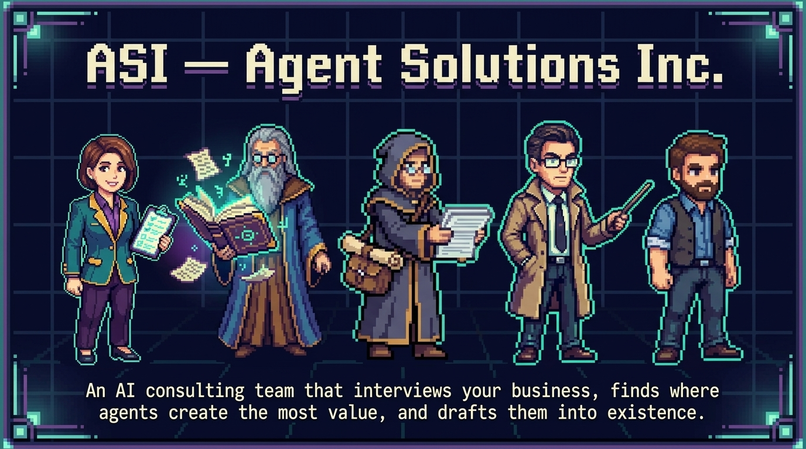
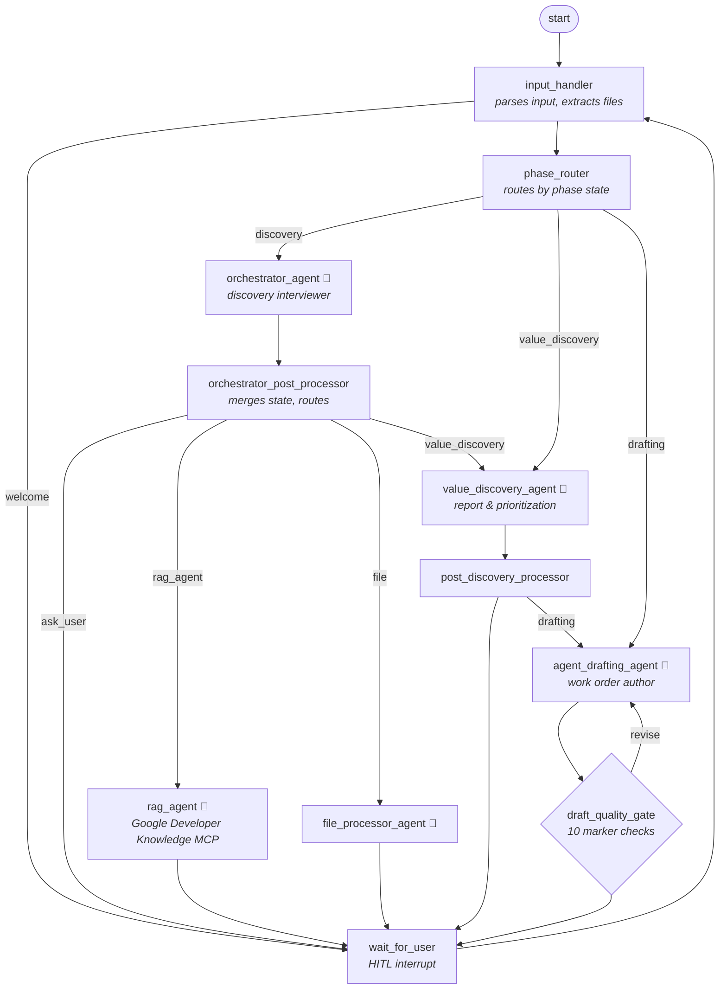
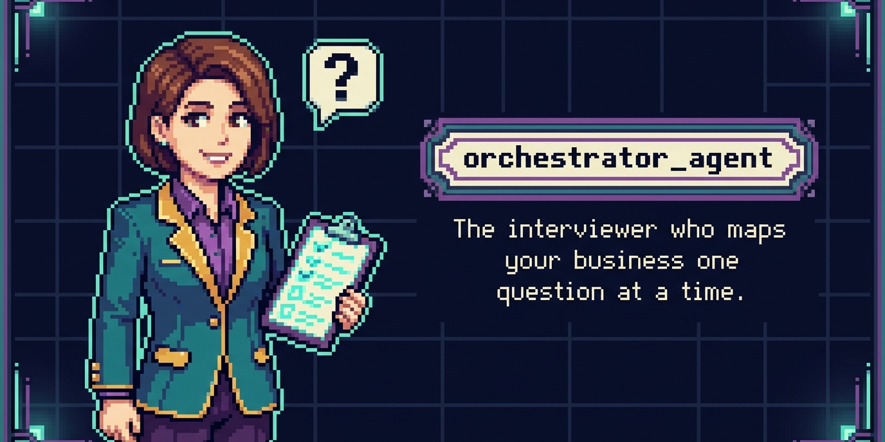
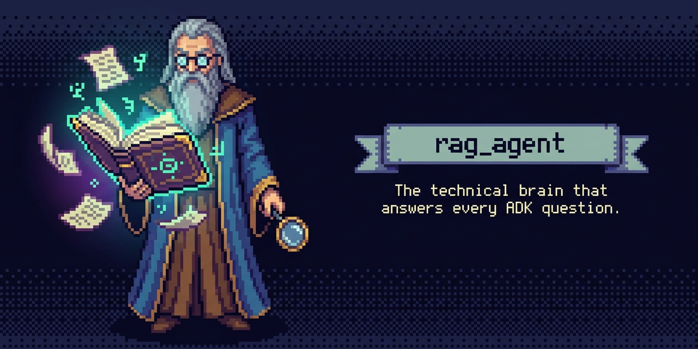
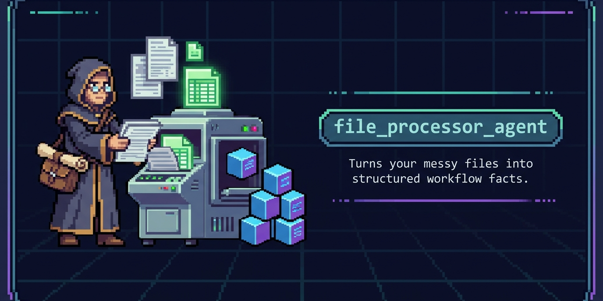
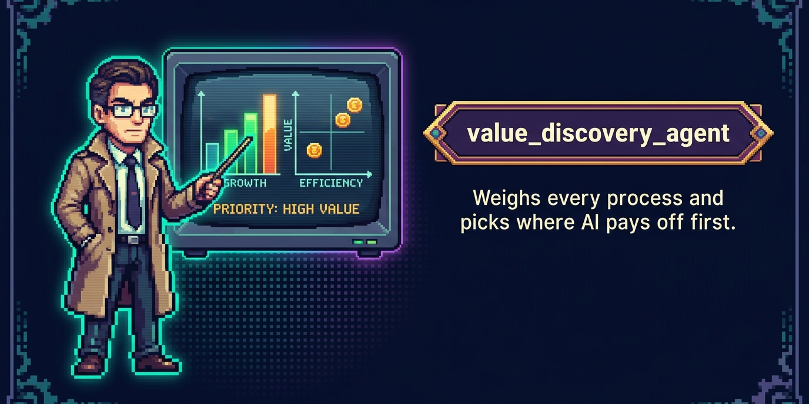
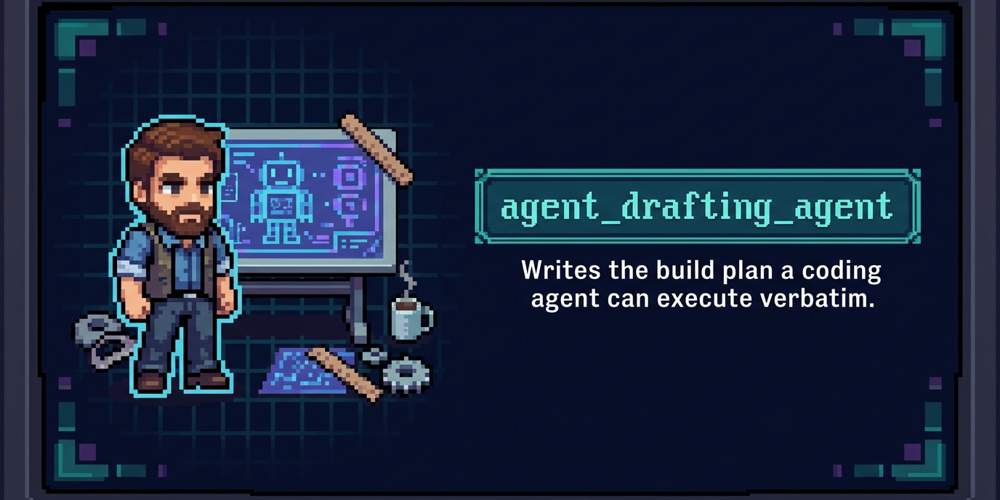

<p align="center">
  
</p>

# ASI — Agent Solutions Inc. (Digital Consultant)

**An AI consulting team that interviews your business, finds where agents create the most value, and drafts them into existence.**

Built for the 5-Day Intensive Agent Course capstone — *Agents for Business* track — with **Google ADK 2.0** (graph `Workflow`, multi-agent) and **agents-cli**.

---

## Problem Statement

Most business owners are not technical people. But they are the ones who decide where AI goes in their company. This matters a lot in Vietnam, where most companies are small or medium-sized. The owner often runs everything. There is no IT department to call and no budget for a consulting firm.

These owners hear about AI agents every day. YouTube and LinkedIn keep telling them agents will change their business. But the advice stops there. Nobody shows them where an agent fits in their invoicing, their scheduling, their customer messages. Some try "vibe coding" with an AI tool, but they lack the words to describe what they want. They can't tell a coding agent "build me a WhatsApp bot that checks my service area and quotes by bedroom count" — because nobody helped them get from "I'm drowning in admin" to that sentence.

An agent only creates value when it sticks to a real business process. Finding that process takes structured discovery work. Today that work costs consulting money that SMEs don't have.

## Why Agents?

The current options are bad. A consulting firm costs too much for a 15-person company. A hired developer knows code but not the business. A static form or questionnaire can't handle the messy way real owners describe their work ("we use WhatsApp and a whiteboard, my sister does the books").

An agent fits this job for four reasons:

- **It interviews like a consultant.** Discovery is a conversation, not a form. The owner says "the phone never stops" and the agent turns that into a measurable problem: repeated pricing questions, lost weekend leads, manual scheduling.
- **It hides the technical work.** The owner never needs to know what an API is. The agent asks about their tools in plain words and handles the technical mapping itself.
- **It repeats for free.** One owner can explore HR today and customer service next month. A human consultant would bill for both visits.
- **It ends with something a machine can execute.** The final output is not a slide deck. It is a build plan written for coding agents — Antigravity, Claude Code, Cursor — so the owner can paste it in and get a working agent.

So the full path becomes: talk about your business in your own words → get a report showing where AI pays off first → get a plan any coding agent can build. No consultant, no developer, no jargon.

---

## Architecture

The system is five LLM agents and five deterministic code nodes on a Google ADK graph workflow. Session state routes each user message to the right phase.



**Phase 1 — Discovery.** An orchestrator agent interviews the user and fills a structured checklist: goals, current metrics, IT systems, activities, decision points, past attempts. Two helper agents support it. A RAG agent answers technical questions using Google's official Developer Knowledge MCP server, so answers come from real docs, not model memory. A file processor agent reads uploaded files (Excel sheets are converted to CSV and images first). The user must explicitly confirm before the system moves on — the workflow cannot skip ahead on its own.

**Phase 2 — Value discovery.** An analyst agent turns the checklist into a report: a value-versus-complexity table, process charts, and exactly one recommended starting point. The user can ask for changes until they approve it.

**Phase 3 — Drafting.** An architect agent first searches the web for current Gemini models and picks one based on cost and capability. Then it writes an 8-section build plan meant to be pasted into a coding agent verbatim: setup, scaffolding, agent architecture, human-in-the-loop points, security, tests, deployment. A deterministic quality gate then checks the saved plan for 10 required elements (the scaffold command, ADK code, injection safeguards, tests, and so on). If anything is missing, the gate sends the plan back with a list of gaps. It retries at most twice, then reports what's still missing instead of looping forever.

Every agent decision passes through a typed schema, so the model can't produce a route the graph doesn't know. Code, not the LLM, owns all state writes. User text is wrapped in tags and every agent's prompt tells it to ignore instructions hidden inside those tags.

### The cast

| | Agent | Role | Tools |
|---|---|---|---|
|  | `orchestrator_agent` | Leads the discovery interview; fills the checklist; enforces the explicit-confirmation gate before reporting | `generate_industry_example` |
|  | `rag_agent` | Answers ADK / agent-ecosystem questions, grounded in Google's official docs via the **Google Developer Knowledge MCP server** (Google Search fallback) | `McpToolset` → `search_documents`, `get_documents` |
|  | `file_processor_agent` | Extracts workflow facts from uploaded files (Excel is pre-converted to CSV + images by `input_handler`) | — |
|  | `value_discovery_agent` | Produces & iterates the Value Discovery report; detects the user's confirmation to proceed | `export_business_state`, `save_discovery_report` |
|  | `agent_drafting_agent` | Researches current Gemini models live, writes the 8-section executable work order | `google_search`, `save_draft_plan` |

### Design decisions worth reading

- **LLM decides, code routes.** Every agent decision is constrained by a Pydantic schema with `Literal` routes (`OrchestratorRouting`, `DiscoveryRouting`) — the model *cannot* emit an unroutable event. Deterministic post-processor nodes own all state writes.
- **State merging, not overwriting** ([`merge_business_state`](app/agent.py)) — the LLM sometimes omits checklist fields it filled earlier; empty values never erase collected data.
- **Deterministic quality gate** ([`draft_quality_gate`](app/agent.py)) — the drafting agent's plan is validated against 10 mandatory markers (scaffold command, ADK imports, HITL design, injection safeguards, tests, Definition of Done…). The gate reads the plan from the **tool-persisted ground truth** (via `ToolContext` state), not the chat text, and loops back with targeted feedback — max 2 retries, then it surfaces the gaps instead of looping forever.
- **Human-in-the-loop by construction** — `wait_for_user` is an ADK `RequestInput` interrupt node; the workflow cannot advance phases without explicit user confirmation (discovery → report → drafting are all user-gated).

### Security

- **Prompt-injection hardening:** all user text is wrapped in `<user_input>` tags by `input_handler`, and every agent's system prompt carries a `SECURITY_WARNING` contract to ignore embedded instructions. Covered by unit tests and an adversarial eval dataset ([tests/eval/datasets/injection_eval.json](tests/eval/datasets/injection_eval.json)) including tag-escape and confirmation-gate-skip attacks.
- **Schema-enforced routing:** unknown routes fail Pydantic validation before touching the graph.
- **No secrets in code:** the only credential (`DEVELOPER_KNOWLEDGE_API_KEY`) is read from the environment, and the system degrades gracefully without it.

---

## The Build

I didn't start with code. I started with the question: how does a human do this job? I used to work as an operations-efficiency consultant for manufacturing companies, so I knew the shape of the work. I asked Antigravity to describe how a consultant at McKinsey, BCG, or Capgemini would approach a client who wants AI agents. From that, I wrote the list of must-have information the system needs before any recommendation makes sense — goals, baselines, systems, decision points, past failures.

Antigravity did about 90% of the build, running gemini-3.1-pro at high effort because the task was complex. My process:

- **Scaffold first.** I had Antigravity generate the project structure with agents-cli, then iterated on the real logic inside it.
- **Two big tasks, built one at a time.** Planning (discover the need, ask for details, confirm, find the value) and Drafting (produce the machine-readable plan). Antigravity wrote an implementation plan for each before coding.
- **A dynamic workflow, not a fixed script.** Real users jump around. They ask "wait, what's ADK?" in the middle of describing their pricing. The graph routes those detours to the RAG agent and comes back.
- **One correction worth sharing:** gemini-3.1-pro kept choosing gemini-2.5-pro as the model for my agents. I had to tell it explicitly to use gemini-3.5-flash for fast answers at lower cost. Model choice is a place where you still have to overrule the tool.
- **Testing with a simulated client.** I used Claude to role-play a business owner — first an HR manager, then the owner of a small cleaning company who "doesn't know what an API is." I pasted the conversation logs back into Antigravity to fix what broke. This loop caught real bugs: the drafting phase was unreachable, and the state kept erasing collected answers. Claude also fixed some errors directly and wrote notes.
- **Security last, on purpose.** Once the agents worked, I did a security pass in Antigravity: input tagging, hardened prompts, schema-locked routing, and an eval dataset of injection attacks.
- **No custom UI needed.** I tested everything in the agents-cli playground, in the browser and the terminal. It was good enough that Claude could drive it directly during the simulated-client tests.

---

## Course Key Concepts Demonstrated

| Concept | Where |
|---|---|
| **Multi-agent system (ADK)** | 5 `LlmAgent`s orchestrated on a 20-edge graph `Workflow` — [app/agent.py](app/agent.py) |
| **MCP Server** | `rag_agent` consumes Google's official **Developer Knowledge MCP server** via ADK `McpToolset` — [app/agent.py](app/agent.py) (`build_rag_tools`) |
| **Security features** | Injection tagging + hardened prompts + schema routing + adversarial evals (above) |
| **Agent skills (agents-cli)** | Project scaffolded, run, linted and evaluated with `agents-cli`; the drafting agent's work orders mandate the same toolchain |
| **Deployability** | Dockerfile + `agents-cli deploy` to Cloud Run (see Setup & Run) |

---

## Setup & Run (for judges)

### 1. Prerequisites

- **Python 3.12+**
- **uv** — [install instructions](https://docs.astral.sh/uv/getting-started/installation/)
- **Google Cloud SDK** — [install instructions](https://cloud.google.com/sdk/docs/install)
- A **GCP project with the Vertex AI API enabled** (the agents run on Gemini via Vertex AI)

### 2. Clone and install

```bash
git clone <this-repo-url>
cd digital-consultant

# Install agents-cli and its skills, then the project dependencies (via uv)
uvx google-agents-cli setup
agents-cli install
```

### 3. Authenticate with Google Cloud

```bash
gcloud auth application-default login
gcloud config set project <your-project-id>
```

### 4. Optional (recommended): Developer Knowledge API key

This powers the `rag_agent` through Google's official Developer Knowledge MCP server, so its answers about ADK come from real documentation. In your GCP project, enable the **"Developer Knowledge API"**, create an API key, then:

```bash
export DEVELOPER_KNOWLEDGE_API_KEY="<your-key>"
```

Without it, the `rag_agent` falls back to Google Search grounding automatically — nothing breaks.

### 5. Run it

```bash
agents-cli playground        # local web UI, auto-reloads on save
```

or a one-shot run from the terminal:

```bash
agents-cli run "help me apply AI to my HR department"
```

The engagement is multi-turn — to continue a conversation from the terminal, resume the same session:

```bash
agents-cli run "<your next message>" --session-id <id>
```

### 6. Tests

```bash
uv run pytest tests/unit tests/integration
```

27 tests: pure logic (state merging, quality gate, industry examples), security hardening (injection tagging, prompt contracts), and a live agent smoke test. The integration test needs the gcloud auth from step 3.

### 7. Evaluation

```bash
agents-cli eval
```

Datasets live in [tests/eval/datasets/](tests/eval/datasets/): industry scenarios plus a set of prompt-injection attacks.

### 8. Deployment (optional)

```bash
gcloud config set project <your-project-id>
agents-cli deploy            # containerized via the included Dockerfile → Cloud Run
```

Telemetry exports to Cloud Trace, BigQuery, and Cloud Logging.

### Troubleshooting

| Symptom | Fix |
|---|---|
| `DefaultCredentialsError` | Run `gcloud auth application-default login` (step 3) |
| Model 404 errors | Check that the Vertex AI API is enabled in your project and the region supports the model |
| Playground port conflicts | `agents-cli run --stop-server`, then start the playground again |

---

## Sample outputs

Real outputs from a test engagement with a 15-person residential cleaning company are in [docs/samples/](docs/samples/): the [value discovery report](docs/samples/sample_value_discovery_report.md) (value/complexity table, process charts, one recommended starting point) and the [8-section agent draft plan](docs/samples/sample_agent_draft_plan.md) (the build plan meant to be pasted into a coding agent).

---

## Project structure

```
digital-consultant/
├── app/
│   ├── agent.py             # All agents, tools, nodes, and the workflow graph
│   └── fast_api_app.py      # FastAPI server entrypoint (used by Docker/Cloud Run)
├── assets/                  # Pixel-art branding (cover, agent cards, thumbnail)
├── docs/samples/            # Real outputs from a sample engagement
├── tests/
│   ├── unit/                # Pure-logic tests (merge, gate, security, examples)
│   ├── integration/         # Live agent smoke test
│   └── eval/datasets/       # agents-cli eval scenarios incl. injection attacks
├── Dockerfile
└── pyproject.toml
```
