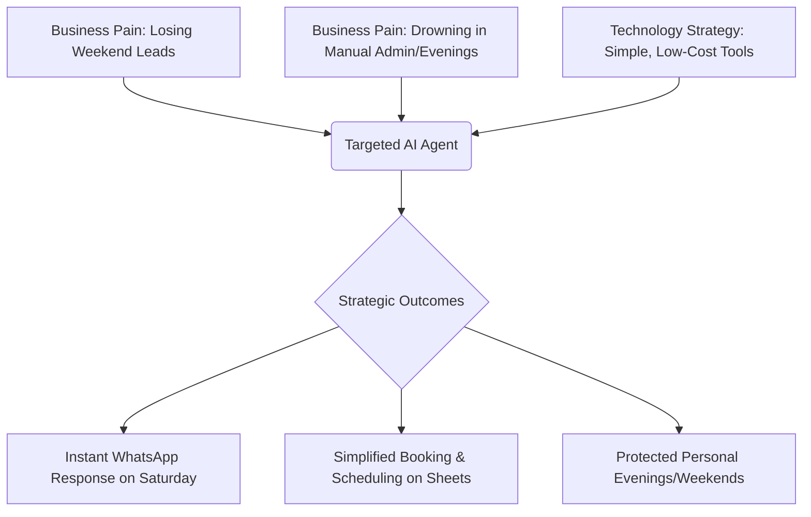
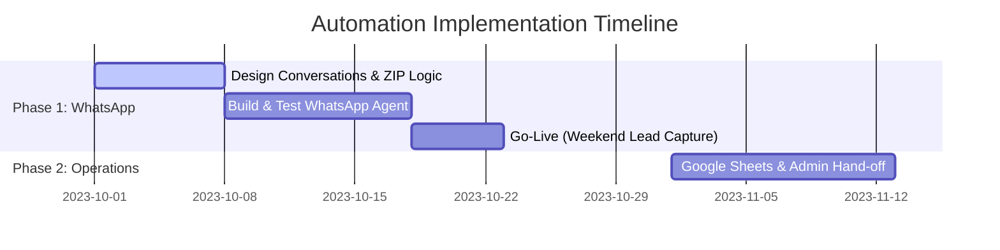

# Value Discovery & Prioritization Report
**Client Industry:** Residential Cleaning  
**Primary Focus:** Operations, Lead Capture, & Customer Support  

---

## 1. Executive Summary & Strategic Alignment
The primary goals for this initiative are to **get evenings back**, **stop losing weekend leads** (by responding instantly on Saturdays), and **keep operations simple** without introducing expensive, over-engineered platforms like Jobber. 

### Alignment Matrix

---

## 2. Activity & Use Case Prioritization

Below is the evaluation of potential areas for automation and AI assistance based on strategic value, ease of implementation, and operational risk.

| Use Case / Activity | Strategic Value | Complexity | Feasibility | Priority / Recommendation |
| :--- | :--- | :--- | :--- | :--- |
| **1. WhatsApp Lead Responder & Lead Qualification** | **Critical** • Solves weekend lead loss. • Responds instantly. • Saves evenings. | **Low-Medium** • Uses WhatsApp Business API. • Simple ZIP & price rules. | **High** • Directly maps to existing ZIP rules & pricing list. | **HIGH (Recommended Starter)** |
| **2. Google Sheets Scheduling Assistant** | **Medium** • Reduces manual scheduling time. | **Medium** • Requires structured data parsing. | **Medium** • High risk of scheduling conflicts if fully automated. | **MEDIUM** (Phase 2) |
| **3. Automated QuickBooks Invoicing** | **Low-Medium** • Saves admin time on invoicing. | **Medium-High** • Requires financial API integration. | **Medium** • User wants to keep things highly simple first. | **LOW** (Defer) |

---

## 3. Recommended Starter Area: WhatsApp Lead Responder
We suggest starting exclusively with the **WhatsApp Lead Responder & Qualification Agent**. 

### Why This is the Perfect Start:
1. **Instant Saturday Responses:** Fully addresses the #1 business leak (losing Saturday inquiries to faster competitors).
2. **Deterministic Rules & Safe AI Boundaries:** 
   * **ZIP Code Verification:** The agent can immediately check if the user is in the serviced areas: `60614, 60618, 60625, 60640, 60645, 60659, 60660`.
   * **Base Pricing Calculations:** Instantly quotes `$110` (1b/1b), `$140` (2b/1b), or `$190` (3b/2b).
   * **Discretionary Add-ons:** Flags extra fees like `$25` for pets or `$30-50` for deep cleans to set realistic customer expectations upfront.
3. **No Complex Software:** Works in the background directly on WhatsApp and logs qualified bookings cleanly, keeping operations lean and avoiding complex suites like Jobber.

---

## 4. Proposed Road Map

